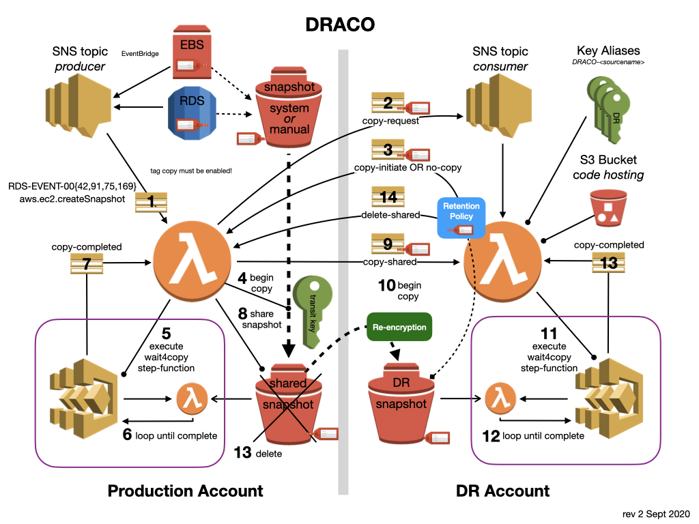

# Introduction

The DR Account Copying system (DRACO) is a skeleton application built to address a common
need - that of moving copies of EBS and RDS snapshots (including RDS Aurora Clusters) to a
separate DR account. Although this problem has been partially addressed before (see [this
AWSLabs Project](https://github.com/awslabs/rds-snapshot-tool)) there are benefits to
implementing an extensible, event-driven and fully serverless solution:

* You can add other types of snapshots to be backed up by listening for the appropriate events.
* You can easily parallelize these long running tasks in a way that is difficult with
  `cron` type solutions.

On the down side not all important events are currently published (for example the "copy
complete" status in an RDS snapshot copy event). Given that event driven and serverless
applications are a core part of the future AWS strategy we expect this situation to
change. Where an event is not available you can write a polling mechanism to generate them
artificially. DRACO illustrates this approach using the `wait4copy` state machine.

## License
This code is licensed under the MIT-0 License. See the LICENSE file.

## Copyright

Amazon.com, Inc. or its affiliates. All Rights Reserved.
SPDX-License-Identifier: Apache-2.0

Author: Nick Townsend (nicktown@amazon.com)

## Diagram



## Usage

Once installed DRACO will copy every EBS and RDS snapshot taken in the designated
'Production' account that is tagged with `Draco_Lifecycle` across to the designated
'Disaster Recovery' account and re-encrypt them with a key known only to the DR account.
There they will accumulate continuously, subject to a retention policy. The retention
policy for a snapshot is determined by the value of the tag `Draco_Lifecycle` which must
take on one of several predetermined values:

* `Test`: This retains the most recent 3 copies, irrespective of time.
* `Weekly`: this retains a rolling 7 days,
* `Fortnightly`: this retains a rolling 14 days,
* `Biweekly`: this retains two: a weekly for the previous week and the most recent daily
   for the current week,
* `SemiMonthly`: this retains 16: the last two weeks of daily snapshots and two weekly
   snapshots (for weeks 3 and 4),
* `Monthly`: this retains a rolling month of daily snapshots,
* `CurrentMonth`: this retains only those snapshots in the current month,
* `Standard`: This retains the most recent daily for a week, the most recent weeklies for
  a month, the most recent monthlies for a year, and the most recent yearly for 7 years.

After a snapshot is copied to DR, all of the snapshots of that type in the DR account are
reviewed and the **current** policy for the source database or volume is applied. This
allows the retention policy to be altered and automatically propagate to the DR account.

To see examples of the policies follow the instructions in [Testing](test/README.md)

## Costs

Minimal. See the approximate [cost calculation](COST.md)

## Limits

Your DR account must have the snapshot limit set so that all the desired snapshots can be
retained. The default limit is 50. If this limit is exceeded DRACO cannot function and
will log an ERROR message to CloudWatch logs.

# Installation

First clone the repository and change into the directory:

```bash
git clone https://github.com/aws-samples/aws-draco.git
cd aws-draco
```

## Setup the Environment:

### Ruby

```bash
sudo gem install bundle
bundle config set path .bundle
bundle install
```

### Cloudformation Linting

Before uploading the CloudFomration templates the Rakefile will call the 'cfn_lint' task,
for this to succeed, install the [AWS CloudFormation
Linter](https://github.com/aws-cloudformation/cfn-python-lint).

On a MacOS system use the command: `brew install cfn-lint`

## Configuration

After cloning the repository create your own configuration file by copying
`config.yaml.sample` to `config.yaml`. Edit this file as appropriate. Note that the
variables in this file will be overridden if an environment variable exists with the same
name.

## Updating the Lambda function code (optional)

If you want to be able to modify the lambda functions, perhaps to add a new lifecycle,
then you will need to create an S3 bucket to hold your copies of the code. If you just
want to use the existing code unchanged then leave the default bucket ('draco') in
`config.yaml`.

To create an S3 bucket update `config.yaml` with your chosen bucket name and execute:

```bash
bundle exec rake setup_bucket
```

This creates a bucket with object versioning enabled to allow the CloudFormation stacks to
be updated. Since the code is already versioned in your repository, a lifecycle policy is set to
automatically expire the code objects stored under the `draco` prefix.

Since both the source (Producer) account and the target (Disaster Recovery) account
require access, the bucket ACL is set to allow read for authenticated users. Note that
this is the simplest way of granting this access. If you are concerned about this
quasi-public visibility then you should implement more sophisticated Bucket and IAM
Policies.

Once you've made any code changes, then upload the code to the bucket with:

```bash
bundle exec rake upload
```

## Create the CloudFormation Stacks

The names of the Producer and Consumer SNS topics are hardcoded within the account and
region as 'DracoProducer' and 'DracoConsumer'. This is to avoid a circular dependency
between the producer and consumer stacks. Create them either from the console or the
command line as follows:

### From the Console

* Sign in to the CloudFormation console __in the source account__ and create a stack using the
  `producer.yaml` template.

* Sign in to the CloudFormation console __in the disaster recovery account__ and create a
  stack using the `consumer.yaml` template.

In both cases note that you will have to change the default input parameters if you have
made any changes.

### From the Command Line

Make sure that `config.yaml` is correctly configured. Note that you can change
`AWS_PROFILE` either by exporting it directly using the shell (`export AWS_PROFILE=zzzz`)
or by updating `config.yaml`. Then:

* Ensure that `AWS_PROFILE` is set to the producer account
* Issue the command: `bundle exec rake create:producer`
* Switch `AWS_PROFILE` to the DR Account
* Issue the command: `bundle exec rake create:consumer`

Note that if you are developing new Lambda functions that you can upload code changes as
described above, and then update the stacks with `bundle exec rake update:<stackname>`.
Typically only the consumer stack is updated when developing lifecycle policies.

## Operation

DRACO uses a tag on the database instance or EBS volume to set the lifecycle policy. In
the RDS case you must ensure that the copying of tags to snapshots is enabled for the
database so that DRACO can propagate the chosen lifecycle. With AWS EBS Backups this
happens automatically. The tag `Draco_Lifecycle` must be present on a snapshot before
DRACO will automatically copy it. Remember to do this when creating Manual EBS snapshots.
The value used to determine the lifecycle is taken from the most recent snapshot, and so
the retention policy can be altered subsequently.

Note that you can specify an additional tag key and value (in `config.yaml`) that will be
added to the snapshots created in the consumer (DR) account.

As soon as the stacks are created, the appropriate EBS and RDS events will be subscribed to, and
so any __new__ snapshots taken in the production account will copy across to the DR
account if appropriately tagged.

When a new snapshot is copied all snapshots of the same type are subject to the lifecycle
policy and potentially deleted.

### Deletion and Dry Run

As a safety measure, the code __will not actually delete any snapshots__ until
the environment variable `NO_DRY_RUN` is set in the Lambda function. This should be done
manually via the console, after checking the CloudWatch logs to make sure that no vital
snapshots would be removed!

## Note on Tags

Normally tags cannot be copied from a shared (or public) RDS snapshot. However DRACO sends
the source tags via the SNS message `snapshot-copy-shared`, from where they are added to
the DR snapshot along with the Draco specific tag specified in `config.yaml`.

## Advanced Use

The code is written in NodeJS. There is a Ruby Rakefile that simplifies the development
process with tasks to set the environment and upload the code to an S3 bucket for
deployment using the CloudFormation console.

### KMS Permissions

Note that the KMS permissions used in the code are somewhat, but not completely,
minimalist. You may wish to curtail them further.

### Rake Tasks

The `Rakefile` contains other tasks for installing, testing and debugging the system. You
can see a list of these with the following command:

```bash
    bundle exec rake -T
```

Some of them rely on a configuration variable 'Role' in `config.yaml`. This should be set
to either 'Producer' or 'Consumer' depending which test messages you wish to send.

### Testing

See the README file in the `test` directory.
